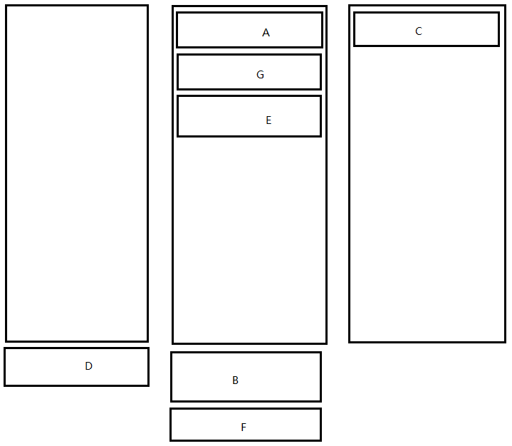

##global对象
global对象  在任何地方都能访问

重要的属性:
- process 进程
- Buffer 缓存
- clearImmediate
- clearInterval: [Function],
- clearTimeout: [Function],
- setImmediate: [Function],
- setInterval: [Function],
- setTimeout: [Function],
- console: [Getter],

##每个文件会自动做以下封装
```javascript
(function (require, exports, module, __dirname, __filename) {
    this = module.exports = exports = {};
    // ...
    return module.exports;
})();
```

- require 需要
- exports 导出
- module模块
- __dirname 所在的目录名路径
- __filename 文件的名字路径 


##process对象
* 目录
```js
__dirname;             // 文件目录不会变
process.cwd();        //current working directory在哪里执行(可变)
process.chdir('..');  //change directory
```

```js
console.log(process.cwd());  // H:\04.learning\node-learning
console.log(__dirname);      // H:\04.learning\node-learning\global
process.chdir('..');         
console.log(process.cwd());  // H:\04.learning
console.log(__dirname);      // H:\04.learning\node-learning\global
```

- 参数
```js
process.argv;
/*
[ 'C:\\00.software\\nodejs\\node.exe',
   'H:\\04.learning\\node-learning\\1.global\\global.js' ]
   */
```

* nextTick()方法

服务有两个小本 他是当前小本的底部

##setImmediate()方法
setImmediate是一个异步方法，并且后面不能指定时间
在setTimeout没有给时间的时候 setImmediate是给setTimeout一些机会的
nextTick > setImmediate > setTimeout > io

```javascript
setImmediate(function A() {
    console.log('a');
    process.nextTick(function B() {
        console.log('b');
        setImmediate(function C() {
            console.log('c');
        });
    });
});
process.nextTick(function D() {
    console.log('d');
    setImmediate(function E() {
        console.log('e');
        process.nextTick(function F() {
            console.log('f');
        });
    });
});
setImmediate(function G() {
    console.log('g');
});
```
运行结果：
```js
d
a
g
e
b
f
c
```

