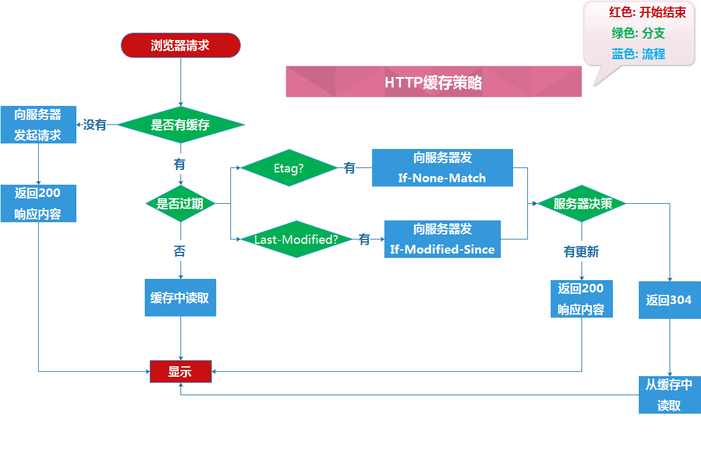

## 一个普通网站访问的过程
1. 浏览器(或其它客户端如微信)向服务器发出一个HTTP请求
2. 先把域名解析为IP地址(chrome缓存1分钟(chrome://net-internals/#dns)->搜索操作系统缓存
   ->读取本地host文件->发起DNS系统调用->运营商DNS缓存->找根域->com域)
3. 客户端通过随机端口向服务器发起TCP三次握手,建立了TCP连接
4. 连接建立后浏览器就可以发送HTTP请求了
5. 服务器接收到HTTP请求，解析请求的路径和参数，经过后台的一些处理之后生成完整响应页面
6. 服务器将生成的页面作为HTTP响应体，根据不同的处理结果生成响应头，发回给客户端
7. 客户端（浏览器）接收到 HTTP 响应,从请求中得到的 HTTP 响应体里是HTML代码，于是对HTML代码开始解析
8. 解析过程中遇到引用的服务器上的资源（额外的 CSS、JS代码，图片、音视频，附件等），再向服务器发送请求
9. 浏览器解析HTML包含的内容，用得到的 CSS 代码进行外观上的进一步渲染，JS 代码也可能会对外观进行一定的处理
10. 当用户与页面交互（点击，悬停等等）时，JS 代码对此作出一定的反应，添加特效与动画
11. 交互的过程中可能需要向服务器索取或提交额外的数据（局部的刷新）,
    一般不是跳转就是通过 JS 代码(响应某个动作或者定时)向服务器发送AJAX请求
    服务器再把客户端需要的资源返回，客户端用得到的资源来实现动态效果或修改DOM结构。
    
## http缓存


- expire

    ```js
    resp.setHeader('Expires', new Date(new Date() + 3000).toUTCString());
    resp.setHeader('Cache-control', 'max-age=3');
    ```
    
- Last-Modified
    服务器返回Last-Modified, 客户端发送if-modified-since
    
- Etag
    服务器返回Etag, 客户端发送if-none-match
    
## 200(from cache)和304区别

200(From cache)是直接点击链接访问，输入网址按回车访问触发(这两种情况都不会有Etag)；
304(Not Modified)是刷新页面时触发，或是设置了长缓存、或当Etag没有移除时触发。